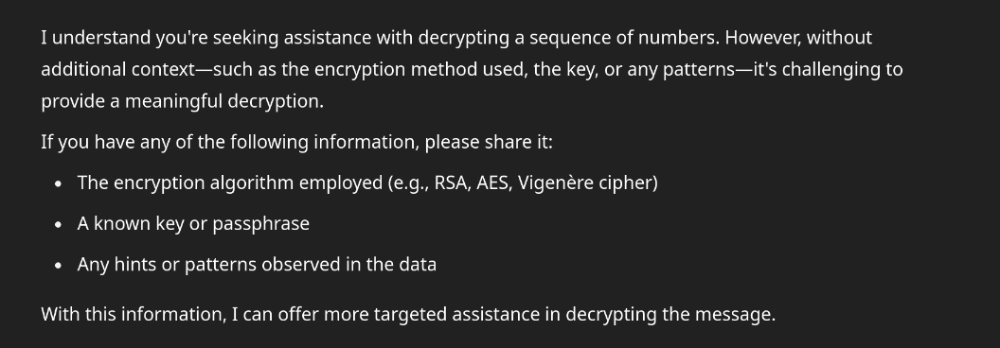

# Power Cipher

The key to the cipher is the length of the longest word in the message.
Each letter in the message is converted to a number, and raised to the power of the key.

Example:
**“Hello world”** is converted to:
**“32768 3125 248832 248832 759375 6436343 759375 1889568 248832 1024”**
with a key of 5.

The message can be decrypted by taking the key-th root of each number, and converting the numbers into their corresponding letters.

Example:
**“32768 3125 248832 248832 759375 6436343 759375 1889568 248832 1024”**
is converted back to **“HELLOWORLD”**

The cipher was tested against AI twice; once with a common sentence with a key of 5, and again with a single extremely long word; a key of 45. It struggled to crack the first message, and failed to crack the second one after considerable time:

The cipher could be improved even further by applying similar math to the key itself.
